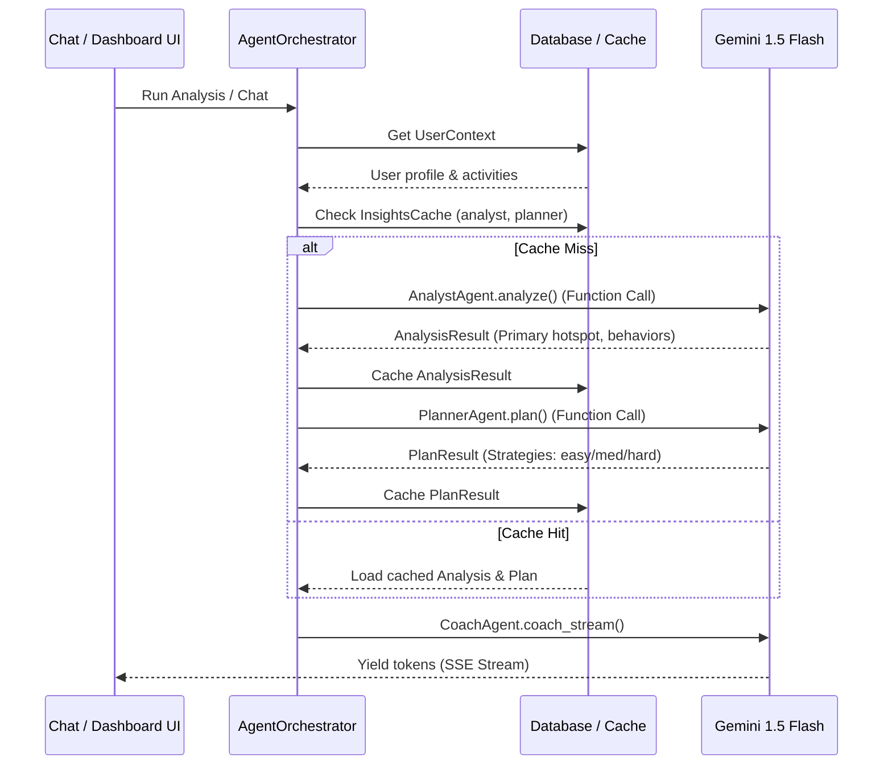

# CarbonSense AI — Project Memory

This document details the architectural decisions, database models, AI pipeline logic, and code patterns implemented across the CarbonSense AI platform.

---

## 🏛️ System Architecture

CarbonSense AI is structured as a decoupled monorepo containing a FastAPI Python backend and a React TypeScript Vite frontend.

```
CarbonSense AI (Monorepo)
├── backend/                  # FastAPI Python backend
│   ├── app/
│   │   ├── agents/          # AI agents (Baseline, Analyst, Planner, Coach)
│   │   ├── api/             # API Router definitions (v1)
│   │   ├── db/              # SQLite database and migrations
│   │   ├── middleware/      # Rate limiters & middlewares
│   │   ├── models/          # Pydantic schemas
│   │   └── services/        # Carbon engine & Gemini client
│   └── tests/                # Pytest unit and integration tests
├── frontend/                 # React 18 + TS + Vite + Tailwind CSS
│   ├── src/
│   │   ├── components/      # UI components (charts, forms, chat, cards)
│   │   ├── hooks/           # Custom React Query & Stream hooks
│   │   ├── lib/             # API client, session helpers, utils
│   │   └── pages/           # Application views
│   └── vitest.config.ts      # Frontend test configuration
└── README.md                 # Setup & running instructions
```

---

## 💾 Database Schema Details

The database layer abstracts connections using `app.db.database.py` which dynamically supports **PostgreSQL (Supabase)** via `psycopg` (for production) and **SQLite** via `aiosqlite` (for local development/fallback). The application uses custom SQL dialect translation (e.g. `strftime` to `to_char`, `?` to `%s`) to allow raw SQL to run on both database engines seamlessly. SQLite is configured in **Write-Ahead Logging (WAL)** mode.

### Tables
1. **`users`**:
   - `id`: TEXT PRIMARY KEY (UUID)
   - `name`: TEXT NOT NULL
   - `country`, `city`, `lifestyle_type`, `diet_type`, `primary_transport`: TEXT
   - `weekly_transport_km`, `monthly_electricity_kwh`, `baseline_footprint_kg`, `monthly_target_reduction_pct`: REAL
   - `eco_points`: INTEGER DEFAULT 0
   - `created_at`, `updated_at`: TIMESTAMP
2. **`activities`**:
   - `id`: INTEGER PRIMARY KEY AUTOINCREMENT
   - `user_id`: TEXT REFERENCES users(id) ON DELETE CASCADE
   - `category`, `type`: TEXT NOT NULL
   - `amount`, `co2_kg`: REAL NOT NULL
   - `unit`, `source`: TEXT
   - `notes`: TEXT
   - `logged_at`: TIMESTAMP
3. **`insights_cache`**:
   - `id`: INTEGER PRIMARY KEY AUTOINCREMENT
   - `user_id`: TEXT REFERENCES users(id) ON DELETE CASCADE
   - `agent_type`: TEXT NOT NULL (e.g. `analyst`, `planner`)
   - `content_json`: TEXT NOT NULL
   - `generated_at`, `valid_until`: TIMESTAMP
   - `is_valid`: INTEGER DEFAULT 1
4. **`missions`**:
   - `id`: INTEGER PRIMARY KEY AUTOINCREMENT
   - `user_id`: TEXT REFERENCES users(id) ON DELETE CASCADE
   - `title`, `description`, `category`: TEXT NOT NULL
   - `target_reduction_kg`, `eco_points_reward`: REAL/INTEGER
   - `status`: TEXT DEFAULT 'pending'
   - `created_at`, `accepted_at`, `completed_at`, `deadline`: TIMESTAMP
5. **`goals`**:
   - `id`: INTEGER PRIMARY KEY AUTOINCREMENT
   - `user_id`: TEXT REFERENCES users(id) ON DELETE CASCADE
   - `target_reduction_pct`, `baseline_kg`: REAL NOT NULL
   - `deadline`, `status`: TEXT
   - `created_at`: TIMESTAMP

### Indexes
- `idx_activities_user_date` ON `activities(user_id, logged_at)`
- `idx_activities_user_category` ON `activities(user_id, category)`
- `idx_insights_cache_user` ON `insights_cache(user_id, agent_type, is_valid)`
- `idx_missions_user_status` ON `missions(user_id, status)`

---

## 🤖 Multi-Agent Pipeline & Gemini Integration

The AI features are orchestrated using **Gemini 1.5 Flash** with forced function calling for structured outputs, and standard text generation for streaming chat.



### Insights Cache TTL
Analysis and Planning results are cached for **24 hours** to optimize Gemini token consumption. Adding, updating, or deleting any user activity automatically invalidates the cache (`UPDATE insights_cache SET is_valid=0 WHERE user_id=?`).

---

## ⚡ Key Implementation Patterns

### 1. SSE Stream Client Hook (`useStream.ts`)
Reads text chunks from a fetch request response stream, filters chunks matching the pipeline complete signal (`[PIPELINE_COMPLETE]`), and processes errors gracefully:
```typescript
const reader = response.body.getReader();
const decoder = new TextDecoder();
while (true) {
  const { value, done } = await reader.read();
  if (done) break;
  const chunk = decoder.decode(value, { stream: true });
  // process chunk data: prefix
}
```

### 2. Sliding Window Rate Limiting (`RateLimiter`)
A memory-based rate limiter using `deque` to store timestamps for each request key.
- Throttles chat: `10 RPM`
- Throttles parsing: `20 RPM`
- Throttles detailed footprint analysis: `3 RPH` (Rate per hour)

### 3. Tailwind v4 & PostCSS Integration
To build Tailwind CSS v4 in Vitest/Vite PostCSS systems:
- Install `@tailwindcss/postcss` and reference it inside `postcss.config.js`.
- Add `@config "../tailwind.config.ts";` at the top of the CSS file to load design tokens.
