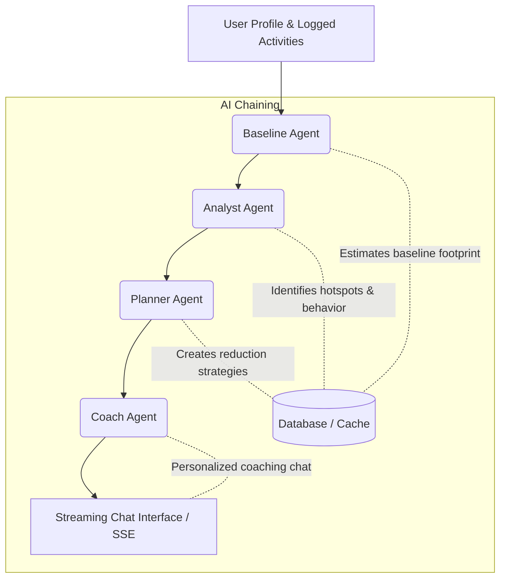

# CarbonSense AI 🌿

CarbonSense AI is a multi-agent carbon footprint coaching platform built for **PromptWars Challenge 3 (Google for Developers × H2S)**. It helps individuals track, analyze, and reduce their carbon footprint through an AI-powered coaching pipeline, a natural language activity logger, and a gamified mission center.

---

## 🚀 Key Features

1. **Multi-Agent AI Coaching Pipeline**: Chained agents (Baseline → Analyst → Planner → Coach) that estimate, analyze, plan, and coach users interactively.
2. **AI Natural Language Activity Logger**: Log daily activities (e.g., *"I drove 25km in a petrol car"* or *"We ate a beef burger"*) and let AI parse, categorize, and calculate carbon impact instantly.
3. **Multi-Provider AI Support**: Seamlessly switch between the best LLMs right from the UI without restarting the server! Powered by **Groq, Google Gemini, Anthropic, OpenAI, and OpenRouter**. Includes automatic fallbacks if a provider times out.
4. **Interactive Insights Dashboard**: View carbon footprint breakdowns by category (Pie Chart), daily emission trends (Line Chart), and progress towards monthly reduction goals.
5. **Gamified Mission Center**: Accept and complete AI-suggested carbon reduction challenges to earn Eco Points and level up your Eco-Tier (Phase 2).
6. **Real-time Streaming Chat**: Converse with a persistent personal coach who retains context of your profile, activities, and active goals via blazing-fast SSE (Server-Sent Events).

---

## 🛠️ Technology Stack

- **Frontend**: React 18, TypeScript, Vite, Tailwind CSS, `@tanstack/react-query`, Recharts, Lucide Icons, and Vitest.
- **Backend**: FastAPI (Python 3.11+), SQLite (via `aiosqlite` for async I/O), Pydantic v2, and Pytest.
- **AI Integration**: Custom Provider Abstraction supporting Groq, Gemini, OpenAI, Anthropic, and OpenRouter via SDKs and direct REST calls.
- **Environment & Dev**: Docker Compose, GitHub Actions.

---

## 🏗️ Multi-Agent Pipeline Architecture



---

## 💻 Running the App (Bare-Metal / Local)

If you prefer running the app directly on your host machine:

### Prerequisites
- **Node.js** v18+
- **Python** v3.11+
- At least one AI API Key (e.g. Gemini, Groq, OpenRouter)

### 1. Backend Setup
1. Navigate to the backend directory:
   ```bash
   cd backend
   ```
2. Create your `.env` file from the example:
   ```bash
   cp .env.example .env
   ```
3. Add your `GEMINI_API_KEY` (or other keys like `GROQ_API_KEY`) to the `.env` file. You can also add keys dynamically in the Frontend UI later!
4. Install Python dependencies:
   ```bash
   pip install -r requirements.txt
   ```
5. Run the FastAPI development server:
   ```bash
   uvicorn app.main:app --reload
   ```
   *The backend will be available at `http://localhost:8000`*

### 2. Frontend Setup
1. Navigate to the frontend directory:
   ```bash
   cd frontend
   ```
2. Create your `.env` file from the example:
   ```bash
   cp .env.example .env
   ```
3. Install Node dependencies:
   ```bash
   npm install
   ```
4. Start the Vite development server:
   ```bash
   npm run dev
   ```
   *The frontend will be available at `http://localhost:5173`*

---

## 🐳 Running the App (Docker Compose)

For a seamless 1-click deployment using Docker:

1. Create the `.env` files for both frontend and backend as described above. Ensure your keys are placed inside `backend/.env`.
2. From the **root** directory of the repository, build and run the containers:
   ```bash
   docker-compose up --build -d
   ```
3. Access the application:
   - **Frontend**: `http://localhost:80` (or just `http://localhost`)
   - **Backend API Docs**: `http://localhost:8000/docs`

> Note: The SQLite database is automatically volume-mapped to persist data across container restarts.

---

## ⚙️ AI Settings & Configurations

You can change your AI model or provider directly from the **Settings** page in the UI without touching the `.env` file.
1. Click **Settings** in the sidebar.
2. Select your preferred **Provider** (e.g., Groq for maximum speed, Gemini for large contexts, OpenRouter for specialized open-source models).
3. Select the model and securely input your API key (stored locally in your browser session).

---

## ☁️ Cloud Deployment (Vercel & Render)

We have pre-configured this repository for a seamless cloud deployment using **Render** for the Backend and **Vercel** for the Frontend.

### 1. Deploy the Backend to Render
Render provides a great free tier for Dockerized FastAPI apps.
1. Push this repository to your GitHub account.
2. Sign up/Log in to [Render](https://render.com).
3. Click **New +** -> **Blueprint**.
4. Connect your GitHub account and select this repository.
5. Render will automatically detect the `render.yaml` file in the root directory and spin up the `carbonsense-backend` service.
6. Once deployed, copy your new backend URL (e.g., `https://carbonsense-backend.onrender.com`).

### 2. Deploy the Frontend to Vercel
Vercel is the optimal hosting platform for Vite/React applications.
1. Sign up/Log in to [Vercel](https://vercel.com).
2. Click **Add New...** -> **Project**.
3. Import your GitHub repository. Vercel will automatically detect that it's a Vite project.
4. **Important**: Change the **Root Directory** from the default `/` to `frontend`.
5. Under **Environment Variables**, add:
   - `VITE_API_URL` = Your Render Backend URL (e.g., `https://carbonsense-backend.onrender.com`)
6. Click **Deploy**. The `vercel.json` file ensures routing works flawlessly.

### 3. Finalize CORS Settings
Once your Vercel frontend is live, you must tell your Render backend to accept requests from it:
1. Go to your Render Dashboard -> carbonsense-backend -> **Environment**.
2. Update the `ALLOWED_ORIGINS` variable to match your Vercel domain (e.g., `https://your-app.vercel.app`).
3. Your full stack is now live!

---

## 🧪 Testing

### Backend Tests
Execute pytest from the `/backend` directory:
```bash
python -m pytest tests/ -v
```

### Frontend Tests
Execute vitest from the `/frontend` directory:
```bash
npm run test:run
```

---

## 🛡️ Security Note

**Never commit your `.env` files to GitHub.** Both the `frontend` and `backend` directories have `.gitignore` files configured to ignore `.env` securely. Use the `.env.example` files as templates when cloning the repo.

---
