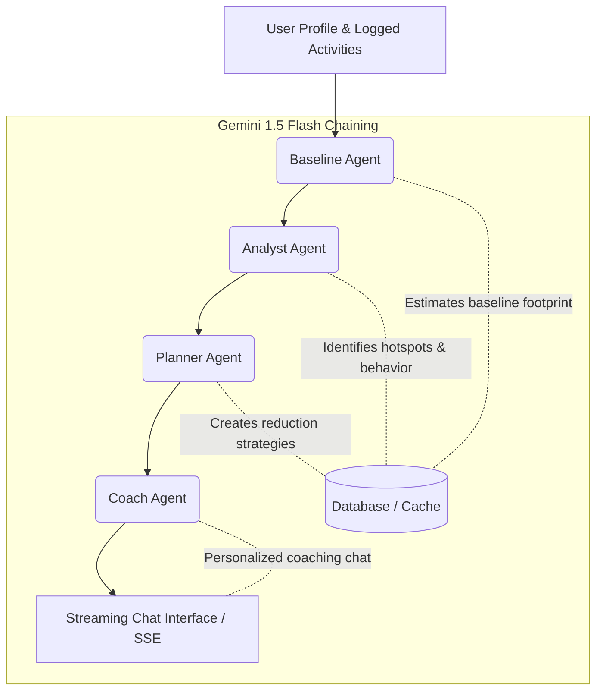

# CarbonSense AI 🌿

CarbonSense AI is a multi-agent carbon footprint coaching platform built for **PromptWars Challenge 3 (Google for Developers × H2S)**. It helps individuals track, analyze, and reduce their carbon footprint through an AI-powered coaching pipeline, a natural language activity logger, and a gamified mission center.

---

## 🚀 Key Features

1. **Multi-Agent AI Coaching Pipeline**: Chained agents (Baseline → Analyst → Planner → Coach) powered by **Gemini 1.5 Flash** to estimate, analyze, plan, and coach users.
2. **AI Natural Language Activity Logger**: Log daily activities (e.g. *"I drove 25km in a petrol car"* or *"We ate beef burger"*) and let AI parse, categorize, and calculate carbon impact instantly.
3. **Interactive Insights Dashboard**: View carbon footprint breakdowns by category (Pie Chart), daily emission trends (Line Chart), and progress towards monthly reduction goals.
4. **Gamified Mission Center**: Accept and complete AI-suggested carbon reduction challenges (e.g. Meatless Mondays, public transit commutes) to earn Eco Points and level up your Eco-Tier.
5. **Real-time Streaming Chat**: Converse with a persistent personal coach who retains context of your profile, activities, and active goals.

---

## 🛠️ Technology Stack

- **Frontend**: React 18, TypeScript, Vite, Tailwind CSS, `@tanstack/react-query`, Recharts, Lucide Icons, and Vitest.
- **Backend**: FastAPI (Python 3.11/3.14), SQLite (via `aiosqlite` for async I/O), Pydantic v2, and Pytest.
- **AI Engine**: Google Gemini 1.5 Flash (via `google-generativeai` SDK).
- **Environment & Dev**: Docker Compose, GitHub Actions.

---

## 🏗️ Multi-Agent Pipeline Architecture



1. **Baseline Agent**: Evaluates user profile attributes (diet, transport, energy use) on onboarding and estimates a conservative monthly baseline carbon footprint.
2. **Analyst Agent**: Reviews logged activity history to detect category hotspots, changes vs. baseline, and recurring emission patterns.
3. **Planner Agent**: Generates actionable, categorized reduction strategies ranked by difficulty (easy, medium, hard) and potential carbon offset savings.
4. **Coach Agent**: Leverages the analysis and reduction strategies to stream encouraging, data-backed guidance to the user.

---

## 📊 Carbon Emission Factors Reference

All calculations are aligned with standard international references:
- **Electricity Grid (India)**: `0.708 kg CO₂/kWh` *(Source: CEA India)*
- **Transport (per km)**: `car_petrol=0.21`, `car_diesel=0.17`, `car_electric=0.05`, `bus=0.089`, `train=0.041` *(Source: UK DEFRA 2023)*
- **Food (per kg)**: `beef=27.0`, `lamb=39.2`, `pork=12.1`, `chicken=6.9`, `dairy=3.2` *(Source: Poore & Nemecek, Science 2018)*
- **India Monthly Avg Footprint**: `158.0 kg CO₂` *(Derived from national 1.9 tonnes/year average)*

---

## 💻 Local Setup & Running Guidelines

### Prerequisites
- **Node.js** v18+
- **Python** v3.11+
- **Google Gemini API Key** (Get it from [Google AI Studio](https://aistudio.google.com/))

### 1. Backend Setup
1. Navigate to the backend directory:
   ```bash
   cd backend
   ```
2. Create your `.env` file from the example:
   ```bash
   cp .env.example .env
   ```
3. Set your `GEMINI_API_KEY` in the `.env` file.
4. Install Python dependencies:
   ```bash
   pip install -r requirements.txt
   ```
5. Run the FastAPI development server:
   ```bash
   uvicorn app.main:app --reload
   ```
   The backend will be available at `http://localhost:8000`.

### 2. Frontend Setup
1. Navigate to the frontend directory:
   ```bash
   cd ../frontend
   ```
2. Create your `.env` file:
   ```bash
   cp .env.example .env
   ```
3. Install dependencies:
   ```bash
   npm install
   ```
4. Start the Vite development server:
   ```bash
   npm run dev
   ```
   The frontend will be available at `http://localhost:5173`.

---

## 🧪 Running Tests

### Backend Tests
Execute pytest from the `/backend` directory:
```bash
pytest tests/ -v
```
*Current test suite: **52 tests passing (100%)** with **87% statement coverage**.*

### Frontend Tests
Execute vitest from the `/frontend` directory:
```bash
npm run test:run
```
*Current test suite: **21 tests passing (100%)**.*

---

## 📦 Docker Container Setup
To run the full stack (Frontend + Backend) inside containers:
```bash
docker-compose up --build
```
This launches the backend service at `http://localhost:8000` with volume mapping for local sqlite storage.

---

## 📝 Design & Architecture Decisions

- **Database WAL Mode**: SQLite runs in Write-Ahead Logging (`WAL`) mode with a high timeout threshold to prevent `database is locked` contention during concurrent SSE stream writes and user activity logs.
- **Robust Insights Caching**: Analysis and planning outcomes are cached for 24 hours to optimize token cost, while coaching chat interactions remain fully interactive and non-cached.
- **Tailwind CSS styling**: The user interface uses a harmonized dark slate and emerald green theme with card-based glassmorphism design, delivering a premium look.
